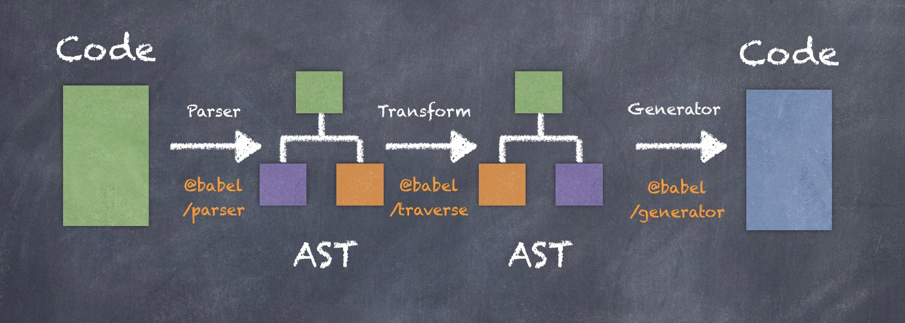

<!--
 * @Author: xiuquanxu
 * @Company: kaochong
 * @Date: 2021-03-26 12:36:46
 * @LastEditors: xiuquanxu
 * @LastEditTime: 2021-03-26 13:22:57
-->
## 工作流程图  

babel转js大致分为三个阶段：  
parser->transform->generator  

## 第一阶段(parser)  

parser(解析)：此过程接受转换之前的源码，输出AST（抽象语法树）。在Babel中负责此过程的包为babel/parser(此目录可见)  

## 第二阶段(transform) 
transform(转换):获取parser输出的AST转换**新的AST**（一般是新语法的AST）。在babel中负责此过程的包为babel/traverse  

## 第三阶段(generator)  
generator(生成): 把transform生成的AST，输出源码。在babel中负责次包的为：babel/generator